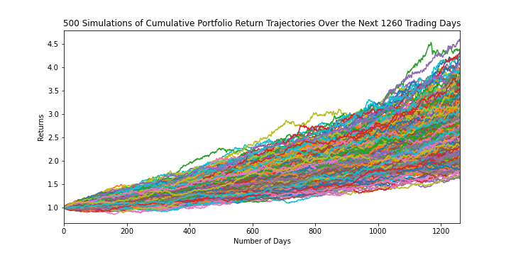
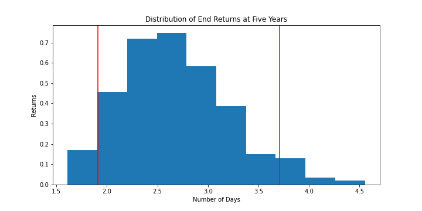

# Home Work API's   

## Unit 5 How do you like them apps?
### Ian Davies   

Following tool generates a report which links to a customers banking and investment accounts, automatically refresheing the data and charts upon login.   

Report contains three section:  
1. Budget-Analysis
2. Financial-Report
3. Retirement-Planner   

**Execution:**   

Analysis obtained by running the following files in order.   

1. account_summary.ipynb
2. portfolio_planner.ipynb   

**Report Generation:**   

Report is contained in a README.md file in the report folder.  Through the ipynb files are sections of code which output results to the 
README.md file.  After each file has been executed, the README.md file is copied to the root folder for display in GIT.
These code sections are commented out as they only need to be executed once unless analysis senario's changes.   

# Budgeting and Financial Planning Report   

Report Date: 2020-07-10
# Budget Analysis   

## Account Summary   
Plaid Checking  
Plaid Saving  
Plaid CD  
Plaid Credit Card  
Plaid Money Market  
Plaid IRA  
Plaid 401k  
Plaid Student Loan  
Plaid Mortgage  
## Transactions Category Summary   
0    Food and Drink
1           Payment
2        Recreation
3             Shops
4          Transfer
5            Travel
Name: category, dtype: object    

## Income Summary   
Previous year's gross income = $6000  
Current monthly income = $500  
Projected Yearly Income = $6085  
## Budget Analysis
### Spending by Category
Food and Drink = $3407  
Payment = $6310  
Recreation = $236  
Shops = $1500  
Transfer = $20537  
Travel = $35  
  
### Monthly Expenses
Feb = $10149  
Mar = $11145  
Apr = $10645  
May = $10645  
Jun = $10645  
Jul = $85  
  
# Financial Report   

### Portfolio Returns Simulation   
  
### Distribution of Cummulative Returns   
90% Confidence intervals:    
Lower value: 102.82524502927662  
Upper value: 379.34210130249653  
  
# Retirement Analysis   

With an intial investment of $20,000:  
There is a 90% chance that an initial investment in the portfolio over the next 
7560 trading days will end within the range of $2,056,504.9
and $6,411,000.0

Expected portfolio returns at the 10th percentile would be $2,380,600.0
at the 50th percentile would be $3,981,800.0
and at the 90th percentile would be $6,411,000.0

Projected returns at the 10th percentile in 30 years:   
With a 4.0%  withdrawal amount of $95,224.0, 
the retirement portfolio will meet or exceed the project annual income of $6,085

With a 50% increase to the investment totalling $30,000
and 4.0% withdrawal amount of $95,224.0,
the retirement portfolio will meet or exceed the project annual income of $6,085

### Portfolio Performance   
  
### Distribution of Median Cummulative Returns   
90% Confidence intervals:    
Lower value: 1.3090480805174707  
Upper value: 152.58752333579451  
  
There is a 90% chance that an initial investment of $20,000 in the portfolio over the next 
7560 trading days will end within the range of $26,180.96
and $3,051,750.47

# Early Retirement Analysis (at Five Years)   

Portfilio adjustment to include more risk (a higher stock than bond ratio) weights (70% SPY; 30% AGG) to determine if retirment possible in 5 years

### Early Retirement: Portfolio Returns Simulation    
  
### Distribution of Cummulative Returns at 5 Years   
90% Confidence intervals:    
Lower value: 1.9078772746934531  
Upper value: 3.7069270031745463  
  
There is a 90% chance that an initial investment of $20,000 in the portfolio over the next 
1260 trading days will end within the range of $38,157.55
and $74,138.54

Expected portfolio returns at the 10th percentile would be $40,800.0
at the 50th percentile would be $52,800.0
and at the 90th percentile would be $67,600.0

Worst case - returns at the 10 percentile in 5 years:   
With a 4.0% withdrawal amount of $1,632.0, the retirement portfolio will NOT meet or exceed the project annual income of $6,085

Best case - returns at the 90 percentile in 5 years:    
With a 4.0% withdrawal amount of $2,704.0, the retirement portfolio will NOT meet or exceed the project annual income of $6,085

With a 50% increase in the intital investment = $30,000

Worst case - returns at the 10 percentile in 5 years:   
With a 4.0% withdrawal amount of $2,448.0, the retirement portfolio will NOT meet or exceed the project annual income of $6,085

Best case - returns at the 90 percentile in 5 years:   
With a 4.0% withdrawal amount of $4,056.0, the retirement portfolio will NOT meet or exceed the project annual income of $6,085
