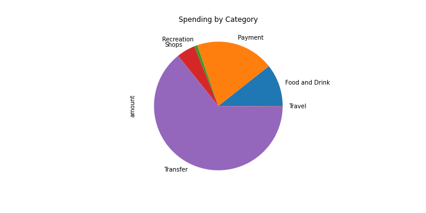
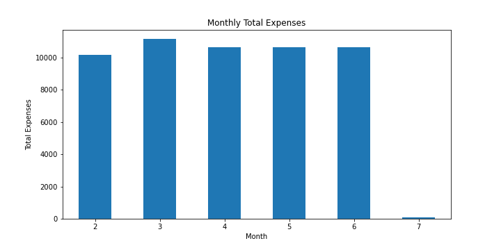
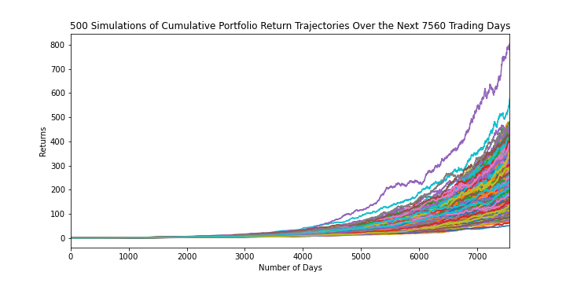
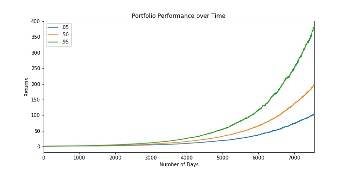
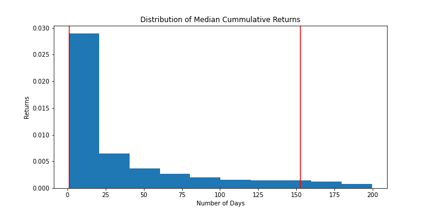

# Budgeting and Financial Planning Report   

### Ian Davies   

### Home Work API's   

Report Date: 2020-07-08
# Budget Analysis   

## Account Summary   
Plaid Checking  
Plaid Saving  
Plaid CD  
Plaid Credit Card  
Plaid Money Market  
Plaid IRA  
Plaid 401k  
Plaid Student Loan  
Plaid Mortgage  
## Transactions Category Summary   
0    Food and Drink
1           Payment
2        Recreation
3             Shops
4          Transfer
5            Travel
Name: category, dtype: object    

## Income Summary   
Previous year's gross income = $6000  
Current monthly income = $500  
Projected Yearly Income = $6085  
## Budget Analysis
### Spending by Category
Food and Drink = $3317  
Payment = $6310  
Recreation = $236  
Shops = $1500  
Transfer = $20537  
Travel = $35  
  
### Monthly Expenses
Feb = $10145  
Mar = $11145  
Apr = $10645  
May = $10645  
Jun = $10645  
  
# Portfolio Planner   

### Portfolio Returns Simulation   
  
### Distribution of Cummulative Returns   
90% Confidence intervals:    
Lower value: 102.82560628760503  
Upper value: 379.34180755577614  
  
# Retirement Analysis   

There is a 90% chance that an initial investment of $20,000 in the portfolio over the next 
7560 trading days will end within in the range of $2,056,512.1257521005
and $7,586,836.151115523   
With an intial investment of $20,000:  
Expected portfolio returns at the 10th percentile would be $2,380,600.0
at the 50th percentile would be $3,981,600.0
and at the 90th percentile would be $6,411,200.0   
  
With a projected annual income of $6,085  
and 4% withdrawal amount = $95,224.0, 
the retirement portfolio will meet or exceed the project annual income of $6,085 at the 10th percentile
  
With a 50% increase to the investment to a value of $30,000
and 4% withdrawal amount = $95,224.0,
the retirement portfolio will meet or exceed the project annual income of $6,085 at the 10th percentile
### Portfolio Performance   
  
### Distribution of Median Cummulative Returns   
90% Confidence intervals:    
Lower value: 1.3090429789335039  
Upper value: 152.58703610007248  
  